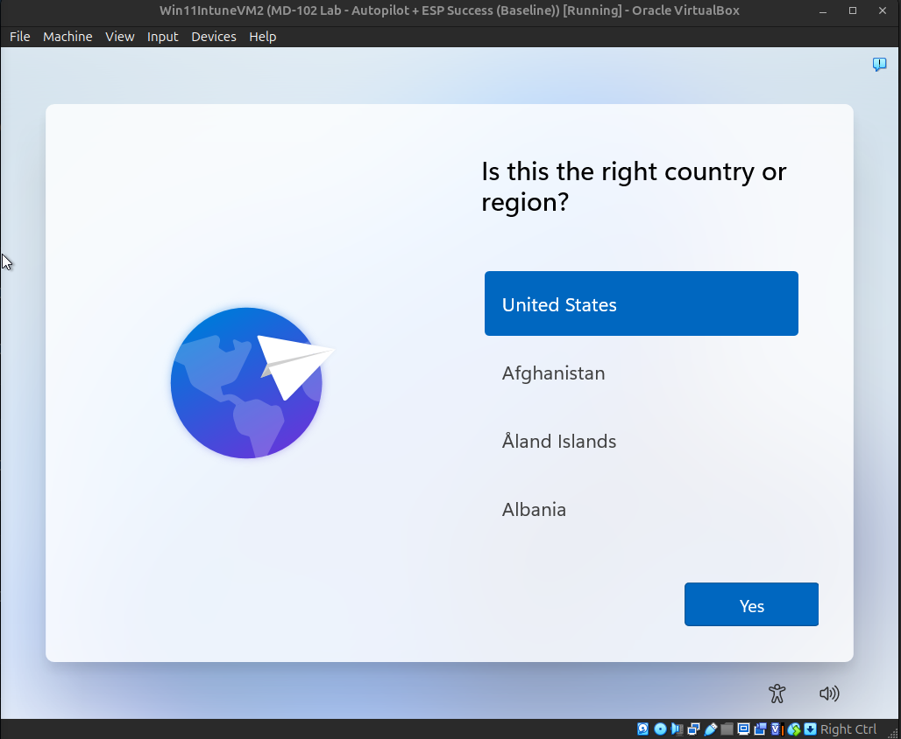
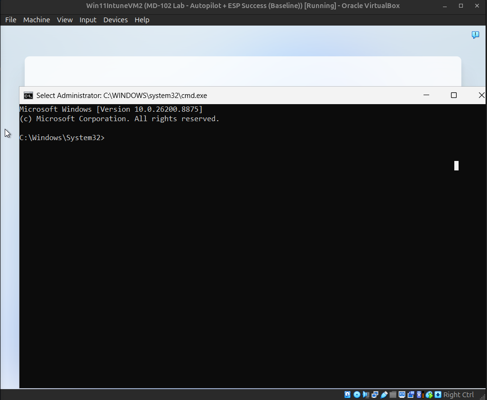
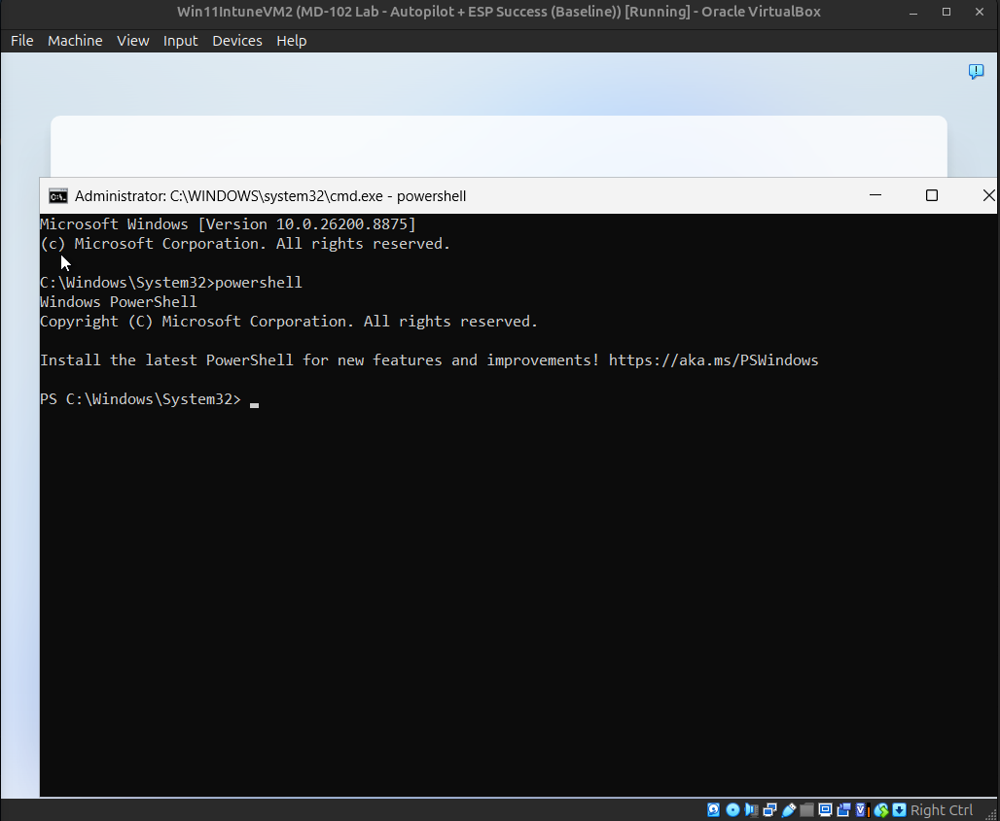
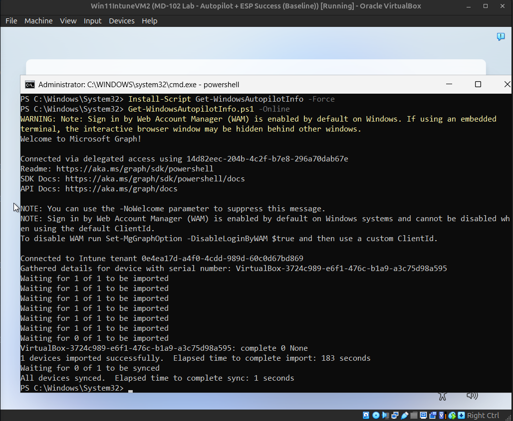
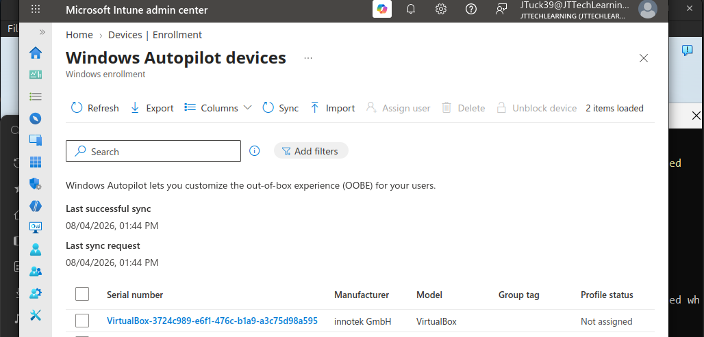
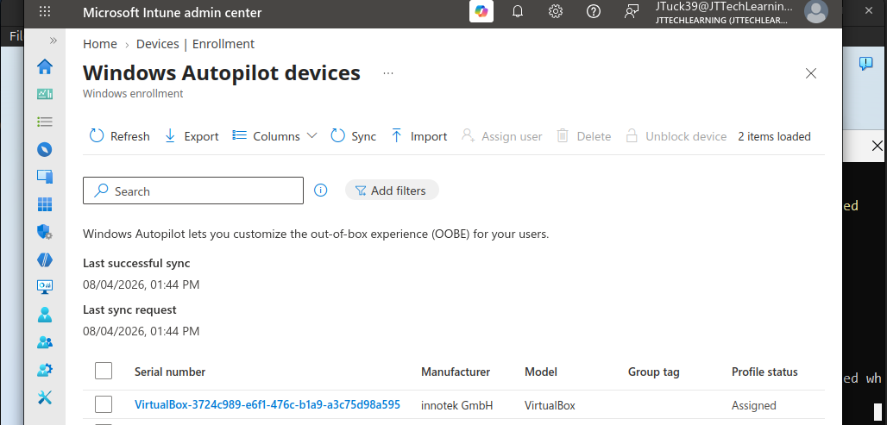
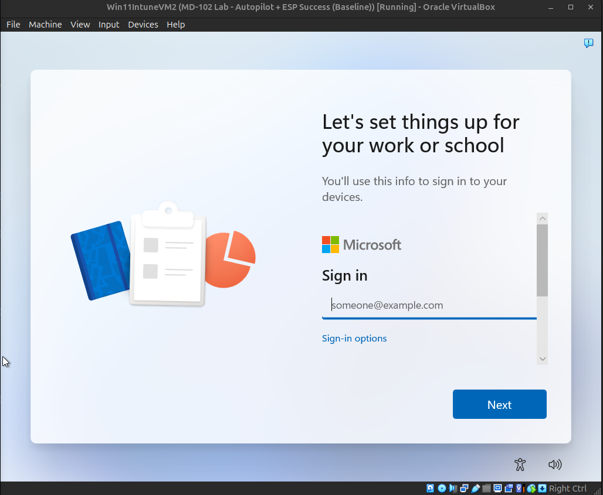
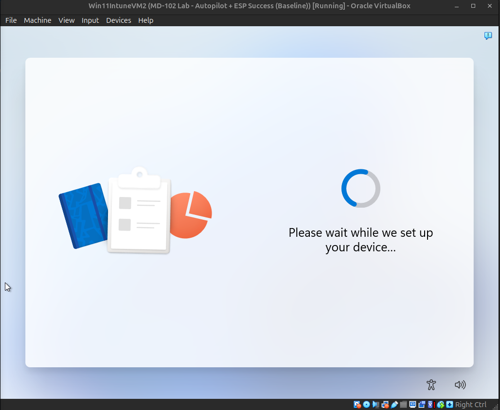
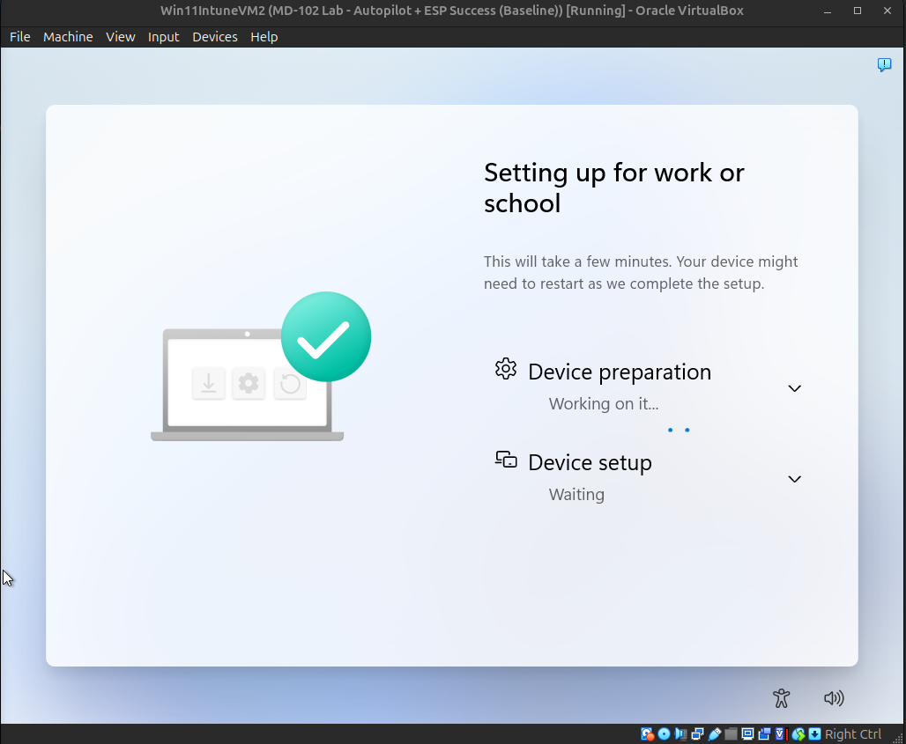
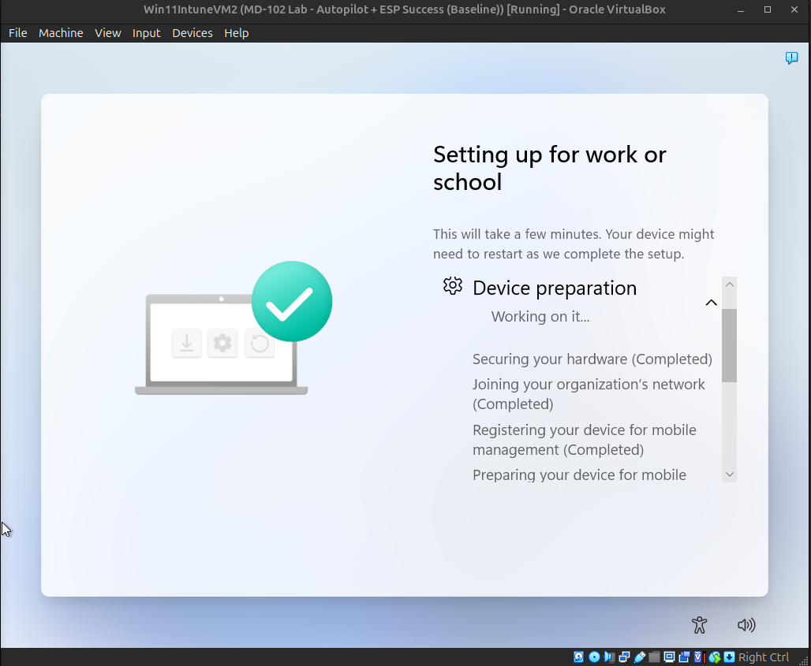

# Windows Autopilot Deployment

## Overview

This project demonstrates a complete Windows Autopilot deployment using Microsoft Intune within a Microsoft 365 Developer tenant.

The deployment covers:

- Windows Autopilot registration
- Online hardware hash upload
- Autopilot profile assignment
- Out-of-Box Experience (OOBE)
- Enrollment Status Page (ESP)
- Windows Hello for Business
- Microsoft Intune enrollment
- Win32 application deployment
- Deployment validation

---

## Lab Environment

| Component | Details |
|-----------|---------|
| Hypervisor | Oracle VirtualBox |
| Host OS | Ubuntu Linux |
| Guest OS | Windows 11 |
| Identity | Microsoft Entra ID |
| MDM | Microsoft Intune |
| Deployment | Windows Autopilot |

---

# Deployment Walkthrough

## 1. Region Selection

The Windows 11 Out-of-Box Experience (OOBE) begins with the initial region selection before any device provisioning occurs.

---

## 2. Launch Command Prompt

Command Prompt was opened during OOBE using **Shift + F10** to begin collecting the Windows Autopilot hardware hash.

---

## 3. Launch PowerShell

PowerShell was launched from Command Prompt to install and execute the Windows Autopilot deployment script.

---

## 4. Upload Hardware Hash

The device hardware hash was uploaded directly to Microsoft Intune using the **Get-WindowsAutopilotInfo.ps1 -Online** method.

---

## 5. Device Imported into Windows Autopilot

After a successful upload, the device appeared in the Windows Autopilot Devices list.

---

## 6. Deployment Profile Assigned

The Windows Autopilot deployment profile was automatically assigned to the imported device.

---

## 7. Organization Sign-in

After rebooting, Windows recognized the device as an Autopilot-managed device and presented the organizational sign-in screen.

---

## 8. User Authentication

The assigned Microsoft Intune user authenticated to begin device enrollment.

---

## 9. Device Preparation

Windows Autopilot started preparing the device by applying enrollment settings and provisioning policies.

---

## 10. Enrollment Status Page (ESP)

The Enrollment Status Page (ESP) initialized and began configuring the device before allowing user access.

The device preparation phase completed successfully and continued through the required deployment tasks.

---

## Deployment Results

The deployment successfully completed with the following outcomes:

- Windows Autopilot profile assigned
- Microsoft Entra ID join completed
- Microsoft Intune enrollment successful
- Enrollment Status Page completed
- Windows Hello configured
- Required Win32 applications installed
- Device successfully managed by Microsoft Intune

---

# Troubleshooting

During development of this lab, several real-world issues were encountered and resolved.

### Online Hardware Hash Upload

The initial online upload returned a **401 Unauthorized** error when attempting to authenticate with a standard licensed user account.

The issue was resolved by authenticating with the Global Administrator account, allowing the hardware hash to upload successfully to Microsoft Intune.

### Virtual Machine Testing

Multiple deployment cycles were performed to validate the Windows Autopilot process, including:

- Re-registering the device with Windows Autopilot
- Removing and re-importing the hardware hash
- Verifying deployment profile assignment
- Testing Enrollment Status Page (ESP) behavior
- Validating Microsoft Intune enrollment
- Confirming Win32 application deployment

---

# Skills Demonstrated

- Microsoft Intune Administration
- Windows Autopilot
- Microsoft Entra ID
- Windows Hello for Business
- Enrollment Status Page (ESP)
- Win32 Application Deployment
- Device Enrollment
- Endpoint Management
- Microsoft Graph PowerShell
- Windows OOBE Customization
- Technical Troubleshooting
